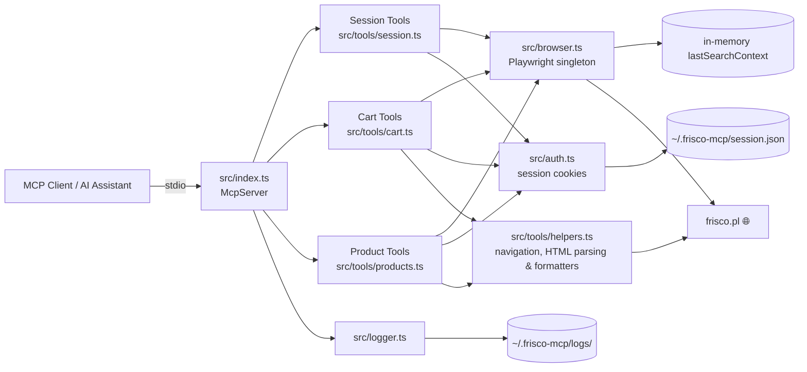

# Frisco MCP

A TypeScript **Model Context Protocol (MCP)** server that lets AI assistants (Claude, Gemini, etc.) interact with [frisco.pl](https://www.frisco.pl/) — Poland's online grocery store.

> **Security First** — The server **never** stores your email or password. You log in manually in a visible browser window; only session cookies are persisted locally.


---

## Features

### Session

| Tool             | Description                                                                                                                     |
| ---------------- | ------------------------------------------------------------------------------------------------------------------------------- |
| `login`          | Opens a visible Chromium window at the login page. You log in manually; the server polls for success and saves session cookies. |
| `finish_session` | Opens the browser at the checkout page so you can select a delivery slot and pay. **No automatic payment.**                     |
| `clear_session`  | Closes the browser and deletes the saved session file.                                                                          |

### Cart

| Tool                    | Description                                                                                                                                                                                     |
| ----------------------- | ----------------------------------------------------------------------------------------------------------------------------------------------------------------------------------------------- |
| `add_items_to_cart`     | Adds products to cart. Supports two flows: **(1)** via `productUrl` — navigates directly to the product page and clicks "Do koszyka"; **(2)** from the latest `search_products` result page.   |
| `view_cart`             | Returns the current cart contents and total price.                                                                                                                                               |
| `remove_item_from_cart` | Removes a specific product from the cart by name (partial match).                                                                                                                                |
| `update_item_quantity`  | Changes the quantity of a product already in the cart (partial name match).                                                                                                                       |
| `check_cart_issues`     | Detects sold-out or unavailable products in the cart and lists available substitutes for each.                                                                                                    |
| `view_promotions`       | Shows active promotions, discounts, and total savings in the current cart.                                                                                                                        |

### Products

| Tool                   | Description                                                                                                                                                       |
| ---------------------- | ----------------------------------------------------------------------------------------------------------------------------------------------------------------- |
| `search_products`      | Searches frisco.pl, returns top N results with prices/availability, and saves search URL/context for cart add.                                                   |
| `get_product_info`     | Returns detailed product info: nutritional values (macros per 100g), weight/grammage, ingredients, price (including original price and unit price if on promotion). |
| `get_product_reviews`  | Returns customer reviews and ratings (from Trustmate) for a product.                                                                                               |

### Logs

| Tool        | Description                                                     |
| ----------- | --------------------------------------------------------------- |
| `get_logs`  | Returns JSONL log events for the current or a specific session. |
| `tail_logs` | Returns the N most recent log events.                           |

---

## Architecture



More diagrams (login flow, cart flow): [`docs/DIAGRAMS.md`](docs/DIAGRAMS.md)

---

## Requirements

- **Node.js** 20 or later
- **Chromium** for Playwright (installed via the setup command below)

---

## Setup

```bash
npm install
npx playwright install chromium
npm run build
```

---

## MCP Client Configuration

The server communicates over **stdio** — point your MCP client at `node dist/index.js`.

### Claude Desktop

Add to `claude_desktop_config.json`:

```json
{
  "mcpServers": {
    "frisco": {
      "command": "node",
      "args": ["/absolute/path/to/frisco-mcp/dist/index.js"]
    }
  }
}
```

### Gemini (Google AI Studio)

The `.gemini/settings.json` in this repo already contains the configuration:

```json
{
  "mcpServers": {
    "frisco-mcp": {
      "command": "node",
      "args": ["/absolute/path/to/frisco-mcp/dist/index.js"]
    }
  }
}
```

### Cursor

Add to your Cursor MCP settings (`~/.cursor/mcp.json` or workspace `.cursor/mcp.json`):

```json
{
  "mcpServers": {
    "frisco": {
      "command": "node",
      "args": ["/absolute/path/to/frisco-mcp/dist/index.js"]
    }
  }
}
```

> **Note:** Replace the path with the absolute path to `dist/index.js` on your machine.

---

## Running as a hosted MCP

When you want the server to live on a different host from the AI
agent, or in a container, point it at a network transport instead of
stdio.

### Transports

`MCP_TRANSPORT` selects the transport:

| Value | Behaviour |
| --- | --- |
| `stdio` (default) | Subprocess transport. The agent spawns the MCP and pipes JSON-RPC over stdin/stdout. |
| `http` | Streamable HTTP transport (stateless, JSON-response). The MCP listens on a port and the agent connects with bearer auth. |

### HTTP-mode environment variables

| Var | Default | Purpose |
| --- | --- | --- |
| `MCP_HTTP_HOST` | `127.0.0.1` | Bind address. |
| `MCP_HTTP_PORT` | `3031` | Bind port. `0` = ephemeral. |
| `MCP_HTTP_BEARER` | _unset_ | Bearer required if `MCP_HTTP_HOST` is non-loopback; the server refuses to start otherwise. Compared with `crypto.timingSafeEqual`. |
| `MCP_HTTP_BODY_LIMIT_BYTES` | `1048576` | Per-request body cap; oversized requests get `413`. |
| `MCP_HTTP_IDLE_TIMEOUT_MS` | `30000` | Slow-client cap (request and keep-alive timeouts). |
| `MCP_HTTP_PATH` | `/mcp` | MCP endpoint path. |
| `MCP_HTTP_HEALTHZ_PATH` | `/healthz` | Liveness probe path. Always `200 ok\n`, no auth. |

The startup banner is a single line on stderr — name, version,
transport, bind address, and `auth=on/off`. It never includes the
bearer value.

### Optional credential autofill

If both `FRISCO_USER` and `FRISCO_PASS` are set, the `login` tool
attempts to fill the email + password fields on the Frisco login page
before its cookie-poll loop. On any selector miss it silently falls
back to the manual flow. **The server never writes either value to a
log, never returns it in a tool response, and never accepts it as a
tool input.**

### Container build

```bash
docker build -t frisco-mcp:latest .
docker run --rm \
  -p 127.0.0.1:3031:3031 \
  -p 127.0.0.1:6080:6080 \
  -v frisco-session:/home/pwuser/.frisco-mcp \
  -e MCP_TRANSPORT=http \
  -e MCP_HTTP_BEARER=changeme \
  frisco-mcp:latest
```

The image bundles Xvfb, x11vnc, and noVNC so the headed Chromium can
run on a server. For the one-time interactive login, point a browser
at `http://127.0.0.1:6080/vnc.html` to drive the visible window. After
the cookie is seated, the server is fully autonomous until the cookie
expires.

`docker-compose.example.yml` ships as documentation-only placeholders.
Copy it to your private deployment repo and fill in real values
there — never commit a real bearer to this fork (it is public).

### MCP client config (HTTP)

```json
{
  "mcpServers": {
    "frisco": {
      "url": "http://127.0.0.1:3031/mcp",
      "headers": { "Authorization": "Bearer changeme" }
    }
  }
}
```

### Healthcheck

```bash
curl -fsS http://127.0.0.1:3031/healthz   # → ok
```

`/healthz` is always public (no bearer required). It is a liveness
probe — it does not check Frisco reachability or session validity. To
distinguish "session current" from "server up", call `view_cart`,
which surfaces a clean error on expired session.

### Signal handling

`SIGTERM` and `SIGINT` trigger a graceful shutdown: the transport
closes, then Chromium tears down, with a 10 s budget before a hard
exit. Container supervisors (`tini` as PID 1; `KillMode=mixed` for
systemd) propagate signals correctly out of the box.

### Audit constraints (don't violate)

- File modes: `~/.frisco-mcp/` = `0700`, `session.json` and
  `*.jsonl` logs = `0600`. Locked by regression tests.
- Headed Chromium only. On a headless host use Xvfb (the bundled
  Dockerfile already does); never set `headless: true`.
- No stealth / anti-bot dependencies. Frisco runs Cloudflare;
  introducing fingerprint evasion violates the site's Terms.
- No telemetry. Outbound at runtime: only `frisco.pl`.

---

## Usage

### 1. Log in

> _"Log me in to Frisco"_

The `login` tool opens a Chromium window at `frisco.pl/login`. Log in manually — the server waits up to 5 minutes and saves your session cookies once it detects a successful login.

### 2. Shop

> _"Find me natural yogurt"_

The `search_products` tool returns a list of matching products with prices. Unavailable products are marked with ⚠️ NIEDOSTĘPNY. It also saves the current search URL and result context for subsequent cart operations.

> _"Tell me more about the PIĄTNICA Skyr"_

The `get_product_info` tool navigates to the product page and extracts detailed information: nutritional values (kcal, protein, fat, carbohydrates, sugars, salt per 100g), weight/grammage, ingredients, price (including original price and unit price for promotional products), and the product URL.

> _"Add it to cart"_

The `add_items_to_cart` tool supports two flows: **(1)** if a `productUrl` is provided (e.g. from `get_product_info`), it navigates directly to that product page and clicks "Do koszyka" — this is the preferred flow; **(2)** otherwise, it uses the latest `search_products` results page to find and add the product.

> _"Remove the butter from my cart"_

The `remove_item_from_cart` tool finds a product in the cart by name and removes it.

> _"Change the milk quantity to 3"_

The `update_item_quantity` tool finds the product in the cart and updates its quantity.

> _"Are there any issues with my cart?"_

The `check_cart_issues` tool scans the cart for sold-out products and shows available substitutes for each.

> _"What reviews does Skyr Piątnica have?"_

The `get_product_reviews` tool fetches customer ratings and reviews from Trustmate.

> _"Show me active promotions in my cart"_

The `view_promotions` tool lists all active promotions, discount badges, and total savings.

### 3. Checkout

> _"Finish my Frisco session"_

The `finish_session` tool opens your cart at `frisco.pl/stn,cart` so you can choose a delivery slot and pay — **the server never performs payment automatically**.

---

## Project Structure

```
frisco-mcp/
├── src/
│   ├── index.ts          # MCP server setup, tool registration
│   ├── auth.ts           # Session cookie save/restore, login check
│   ├── browser.ts        # Playwright browser singleton, product cache, last search context
│   ├── logger.ts         # JSONL session logging
│   ├── types.ts          # Shared TypeScript types
│   └── tools/
│       ├── session.ts    # login, finish_session, clear_session
│       ├── cart.ts       # add_items_to_cart, view_cart, remove_item_from_cart,
│       │                 #   update_item_quantity, check_cart_issues, view_promotions
│       ├── products.ts   # search_products, get_product_info, get_product_reviews
│       └── helpers.ts    # Navigation, popup dismissal, DOM parsing, formatters
│   └── __tests__/        # Unit tests (Vitest)
├── test_data/            # Sample HTML fixtures for tests
│   └── products/         #   Product page HTMLs (skyr, chicken, bananas, eggs, bag, promotion)
├── docs/
│   └── DIAGRAMS.md       # Mermaid architecture & flow diagrams
├── .github/
│   └── workflows/
│       └── test.yml      # CI — runs tests on push & PR
├── dist/                 # Compiled JS (generated by `npm run build`)
├── vitest.config.ts
├── package.json
├── tsconfig.json
└── .gitignore
```

---

## Data Storage

All user data is stored locally in `~/.frisco-mcp/`:

| File                   | Purpose                                |
| ---------------------- | -------------------------------------- |
| `session.json`         | Saved browser cookies (no credentials) |
| `current-session.json` | Pointer to the active log session      |
| `logs/<id>.jsonl`      | Per-session event logs                 |

---

## Development

```bash
# Run in dev mode (tsx, no separate build step)
npm run dev

# Build
npm run build

# Run built server
npm start

# Run tests
npm test

# Watch mode for tests
npm run test:watch
```

### CI

Tests run automatically on every **push** and **pull request** to `master` via GitHub Actions (`.github/workflows/test.yml`). The matrix tests against Node.js 20 and 22.

---

## Tech Stack

| Library                                                                               | Role                          |
| ------------------------------------------------------------------------------------- | ----------------------------- |
| [`@modelcontextprotocol/sdk`](https://github.com/modelcontextprotocol/typescript-sdk) | MCP server framework          |
| [`playwright`](https://playwright.dev/)                                               | Browser automation (Chromium) |
| [`cheerio`](https://cheerio.js.org/)                                                  | HTML parsing for product info |
| [`zod`](https://zod.dev/)                                                             | Input schema validation       |
| [`typescript`](https://www.typescriptlang.org/)                                       | Language & build              |
| [`vitest`](https://vitest.dev/)                                                       | Unit testing framework        |

---

## License

This project is licensed under the [MIT License](LICENSE).
